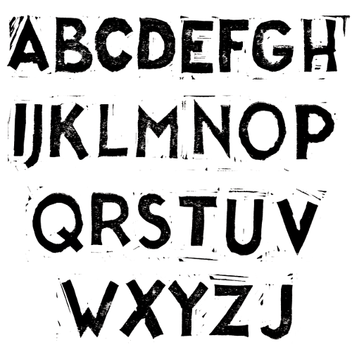

# Lino Cut Font #01
- A font made from lino cut (digitalized and vectorized)
- Individual chars not digitally cleaned up
- All the imperfections caused by cutting, printing to paper, digitalizing the print & tracing the bitmap to vectors are kept

Font coverage:
- Only **A-Z** 
- a-z are the same as A-Z

License: Open Source / Public Domain - [CC0](https://creativecommons.org/publicdomain/zero/1.0/)

Font Preview:

Lino print:

